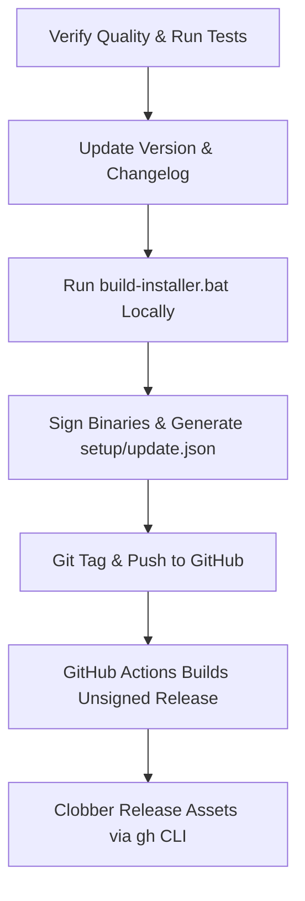

# Wallpaper Turbo - Release & Publishing Guide

This guide describes the release protocol, code signing procedures, and update manifest publishing rules for Wallpaper Turbo. Following this process is critical to ensure that client applications can receive, verify, and apply updates successfully without encountering security validation or integrity errors.

---

## The Core Problem: Updater Security Verification

To protect client systems from tampered or corrupted executables, the Wallpaper Turbo updater uses a dual-verification mechanism:
1. **SHA256 Hash Matching**: The updater fetches the `update.json` manifest, reads the authoritative SHA256 file hash and file size, downloads the installer, and computes its actual hash. The hashes must match exactly.
2. **Authenticode Signature Verification**: Depending on the channel requirement (e.g. `Authenticode` or `Sha256Only`), the downloaded file's digital signature is validated against the publisher name (`COSMO-ARNAB`).

> [!WARNING]
> **The GitHub Actions Race Condition**:
> The GitHub Actions CI workflow (`release.yml`) compiles an **unsigned** installer and generates an `update.json` with the unsigned file's hash and size.
> If the release is published, users will receive an unsigned installer. If you manually replace *only* the installer with your **locally signed** installer, the `update.json` left on GitHub will still contain the hash of the unsigned installer. 
> This mismatch causes the client app to report: **`Security Validation Failed. The downloaded file hash does not match the manifest.`**

---

## Mandatory Release Checklist

Every time a release or tag (e.g., `v1.3.2`) is published, the following workflow **must** be followed:



### Phase 1: Pre-Publish Quality Verification
1. **Run Unit Tests**: Ensure all unit tests pass before compiling the release.
   ```bash
   dotnet test
   ```
2. **Update Version Numbers**: Update version numbers to the target release version (e.g. `v1.3.2`) in the following files:
   - [Directory.Build.props](file:///C:/Users/arnab/PROJECTS/Wallpaper_Turbo/Directory.Build.props) (Project-wide property)
   - [installer.iss](file:///C:/Users/arnab/PROJECTS/Wallpaper_Turbo/src/WallpaperTurbo.Installer/installer.iss) (`MyAppVersion` definition)
   - [App.xaml.cs](file:///C:/Users/arnab/PROJECTS/Wallpaper_Turbo/src/WallpaperTurbo.UI/App.xaml.cs) (If hardcoded display strings are present)
3. **Changelog / "What's New" Modal**: Update the UI's changelog/modal view contents to match the new version's release notes.

### Phase 2: Local Signed Compilation
Run the local compilation and signing script to produce the authoritative release assets:
```cmd
build-installer.bat
```
This batch script automatically:
* Publishes the WPF app in self-contained Release mode (`publish/`).
* Signs all internal executables using the code-signing certificate (`scripts/sign-binaries.ps1`).
* Compiles the Inno Setup installer package (`setup/Wallpaper_Turbo_Setup.exe`).
* Signs the final installer package.
* Runs `scripts/build-update-manifest.ps1` to calculate the correct hash and size of the **signed** installer and write it to `setup/update.json`.

### Phase 3: Push and Git Tagging
Tag the current commit with the version tag and push it:
```bash
git tag v1.3.2
git push origin v1.3.2
```
This push triggers the GitHub Actions workflow (`release.yml`), which builds and publishes the initial (unsigned) release.

### Phase 4: Overwriting Release Assets (CRITICAL)
Once the GitHub Actions run completes, the release assets on GitHub will be incorrect (unsigned). You **must** overwrite them with the locally built, signed assets.

Using the **GitHub CLI (`gh`)**, run the following command from the repository root:
```bash
gh release upload v1.3.2 setup/Wallpaper_Turbo_Setup.exe setup/update.json --clobber
```

> [!IMPORTANT]
> **Always upload both files together**. The `update.json` manifest must match the exact file size and SHA256 hash of the `Wallpaper_Turbo_Setup.exe` that is uploaded to the same release.

---

## Troubleshooting Update Errors

| Error Symptom | Potential Cause | Solution |
| :--- | :--- | :--- |
| `Security Validation Failed. The downloaded file hash does not match...` | `update.json` hash does not match the actual installer file on GitHub. | Re-generate `update.json` using `build-update-manifest.ps1` against the installer, then upload both using `gh release upload --clobber`. |
| `Security Validation Failed. The selected update channel requires stronger signature...` | The client's channel requires `Authenticode` signature verification, but the manifest `min_signature_required` was set to `sha256-only` or not signed. | Ensure the installer is signed before running `build-update-manifest.ps1` and make sure the release channel requirements are aligned. |
| `Cannot verify: Downloaded file is missing.` | The installer did not download correctly or was deleted. | Check network connectivity, examine `updater_diagnostic.log`, and clear the updates cache directory: `%TEMP%\WallpaperTurboUpdates`. |

## Logs & Diagnostics
To inspect updater behavior, refer to the following log file:
* **Diagnostic Log Path**: `%LOCALAPPDATA%\WallpaperTurbo\updater_diagnostic.log`
