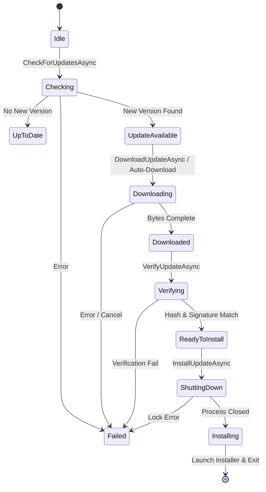

# Wallpaper Turbo - Auto-Update System Guide

This document details the design, architecture, and behavior of the Wallpaper Turbo Auto-Update System. It serves as an authoritative guide for developers and AI agents to understand, maintain, and extend the update pipeline.

---

## 1. System Overview

Wallpaper Turbo features an integrated, state-driven auto-update engine. The updater ensures that clients stay synchronized with the latest releases hosted on GitHub, performs automated background checks and downloads, validates binary integrity using cryptographic hashes, and executes secure handoffs to Inno Setup installers.



---

## 2. Architecture & Components

The auto-update system is built on decoupled, interface-driven services registered inside the dependency injection (DI) container in `App.xaml.cs`.

### Component Diagram

| Component Class / Interface | Responsibility |
| :--- | :--- |
| `IUpdateService` | Evaluates if a newer version is available on the release channel. |
| `IUpdateSourceProvider` (`GitHubReleaseProvider`) | Queries the GitHub Release API and downloads the `update.json` manifest asset. |
| `IDownloadManager` (`HttpDownloadManager`) | Retrieves the binary setup executable using stream-copying and tracks progress. |
| `ISignatureValidator` (`AuthenticodeValidator`) | Validates the Authenticode signature of the downloaded file. |
| `IUpdateApplier` (`InnoSetupApplier`) | Launches the setup installer with silent flags (`/SILENT` / `CLOSEAPPLICATIONS`). |
| `IProcessManager` (`WindowsProcessManager`) | Handles terminating secondary processes (like the wallpaper background runner) to prevent file lock errors. |
| `UpdateCoordinator` | Orchestrates and locks the update state machine across concurrent tasks. |

---

## 3. Auto-Update Scheduling & Background Triggers

Wallpaper Turbo utilizes two main mechanisms for automated update operations:

### 3.1. Startup Update Check & Auto-Download
When the application starts, it reads local configuration settings:
* If `CheckOnStartup` and `AutoUpdateEnabled` are both active, `UpdaterViewModel.RunStartupCheckAsync()` is triggered.
* If an update is detected, the coordinator fires the `UpdateAvailable` event.
* **Auto-Downloading**: When `AutoUpdateEnabled` is `true`, the event handler immediately runs a background Task to download and verify the update:
  ```csharp
  if (_settings.AutoUpdateEnabled)
  {
      _ = Task.Run(async () => await _coordinator.DownloadUpdateAsync());
  }
  ```
* Once downloaded and verified, the status changes to `ReadyToInstall`, prompting the user to install the update.

### 3.2. Periodic Background Checks
To ensure that client systems detect updates during long-running sessions:
* A `DispatcherTimer` runs on a background priority, ticking every **12 hours**.
* If `AutoUpdateEnabled` is enabled, the timer tick triggers a silent update check:
  ```csharp
  await _coordinator.CheckForUpdatesAsync(_settings.ReleaseChannel);
  ```

---

## 4. Local Settings & Configuration

The updater's settings are managed via the `IUpdaterSettingsStore` (`JsonUpdaterSettingsStore`) and saved to `%APPDATA%\Local\WallpaperTurbo\updater_settings.json`.

### Configuration Fields

```json
{
  "ReleaseChannel": "Stable",
  "AutoUpdateEnabled": true,
  "CheckOnStartup": true
}
```

* **`ReleaseChannel`**: Supports `Stable` (major releases), `Preview` (Beta/RC versions), and `Nightly` (Dev builds).
* **`AutoUpdateEnabled`**: Enables/disables automated background checking and downloading.
* **`CheckOnStartup`**: Controls whether an initial update check is run immediately upon application startup.

---

## 5. Security & Verification Pipeline

Security is enforced at multiple check gates during the update lifecycle:

### 5.1. SHA256 Hash Matching
The manifest `update.json` contains an authoritative `sha256` hash of the installer.
After the download completes:
1. The updater reads the file stream and computes its SHA256 hash.
2. It compares it with the hash in the manifest. If they mismatch, the update is instantly rejected and the partial download is deleted.

### 5.2. Authenticode Signature Verification
If the release channel specifies signature requirements:
* The updater runs an Authenticode validation on the downloaded `.exe` to verify that the publisher is `COSMO-ARNAB`.
* If validation fails or the certificate is not trusted, the installer launch is blocked.

---

## 6. Handoff & Shutdown Sequence

When the user initiates installation (`InstallUpdateAsync()`):
1. **State Transition**: Moves to `ShuttingDown`.
2. **Process Termination**: Terminates `WallpaperTurbo.AppRunner.exe` and stops VLC player pipelines to release file locks on dependencies.
3. **Applier Handoff**: Executes the installer in silent mode, passing arguments to close parent windows automatically.
4. **Current Process Exit**: Shuts down the UI process (`WallpaperTurbo.UI.exe`) cleanly so the installer can overwrite active binaries.
